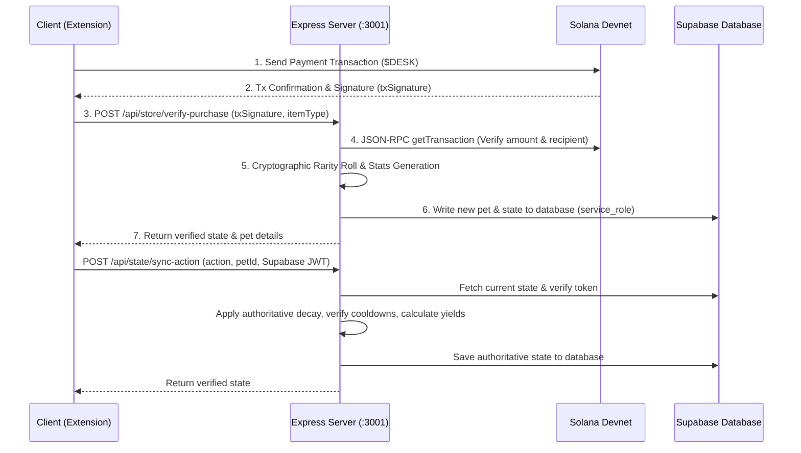

# Implementation Plan: Authoritative Backend Rarity, Secure State Sync, and Cap Adjustments

This implementation plan details the architectural migration of rarity rolling and game progression verification from the client-side Chrome Extension to the authoritative Express backend server, along with database write restrictions and store cap updates.

---

## 🛡️ 1. Proposed Changes & Architecture



### Component Breakdown

---

### [Component: Express Server]
Modify [server.js](file:///e:/2026/code/deskpet/server/server.js) and [package.json](file:///e:/2026/code/deskpet/server/package.json) to handle payment verification, secure progression updates, and database writing.

#### [NEW] [server/.env](file:///e:/2026/code/deskpet/server/.env)
Create an environment file to securely store database secrets and the Solana private key:
* `SUPABASE_URL`: DB Connection URL.
* `SUPABASE_SERVICE_ROLE_KEY`: Service role key to bypass client RLS write restrictions.
* `DISTRIBUTOR_SECRET`: Private key JSON array of the distributor/treasury wallet.

#### [MODIFY] [server/package.json](file:///e:/2026/code/deskpet/server/package.json)
* Add dependencies:
  * `@supabase/supabase-js`: For administrative database writes.
  * `@solana/web3.js` or manual RPC fetch triggers: Add `@solana/web3.js` for robust transaction fetching and address derivation.

#### [MODIFY] [server/server.js](file:///e:/2026/code/deskpet/server/server.js)
* **Initialize Supabase Admin & Solana Keypair:**
  * Import `createClient` from `@supabase/supabase-js`.
  * Load environment variables and construct the Supabase client using the `SUPABASE_SERVICE_ROLE_KEY`.
* **Implement Auth Middleware:**
  * Check the `Authorization` header for the user's Supabase JWT.
  * Call `supabase.auth.getUser(token)` to authorize and get the user UUID (`user.id`).
* **Implement `/api/store/verify-purchase` route:**
  * Fetch Solana transaction data using JSON-RPC.
  * Confirm that it is a successful transaction, signed by the user's wallet, transferring `$DESK` (500 for egg, 5000 for treasury) to the distributor wallet.
  * Check for duplicate transaction signatures.
  * Enforce the 5,000 limit for Treasury pets (queried from DB).
  * Roll rarity (Common, Rare, Epic, Legendary) cryptographically on the server.
  * Write the new pet to the user's stable and save it to the DB.
* **Implement `/api/state/sync-action` route:**
  * Authorize the call and load the user's current `state_data`.
  * Calculate decay over elapsed time (hunger, happiness, energy, passive XP, passive yields).
  * Execute the action (`feed`, `pet`, `buyItem`, `useItem`, `allocateStat`, `startFocus`, `completeFocus`, `claimYield`, `evolve`, or `sync`) with server-side validation.
  * Update database record and return the verified state.

---

### [Component: Chrome Extension Client]
Modify the service worker and UI panels to call Express server API endpoints.

#### [MODIFY] [background.js](file:///e:/2026/code/deskpet/background.js)
* Remove local client-side rarity rolls.
* Update `buyStoreItem` runtime message handler to build and broadcast the Solana payment transaction, then POST the confirmation signature to `/api/store/verify-purchase`.
* Implement a helper function `callBackend(endpoint, body)` that includes the user's Supabase JWT in the `Authorization` header.
* Route all progression actions (`feed`, `pet`, `buyItem`, `useItem`, `allocateStat`, `startFocus`, `completeFocus`, `claimYieldOffchain` / `claimYieldSecure`, `evolveStageSecure`, `syncStats`) to `/api/state/sync-action` on the server when logged in. Keep the local calculations as a fallback for offline gameplay when not logged in.
* Completely delete the `"upgradeRarity"` action handler.

#### [MODIFY] [dashboard.js](file:///e:/2026/code/deskpet/dashboard.js)
* Change all occurrences of `3333` to `5000` for the Treasury Pet cap.
* Remove the button click event listener for `#btn-upgrade-rarity`.

#### [MODIFY] [dashboard.html](file:///e:/2026/code/deskpet/dashboard.html)
* Remove the "Ascend Rarity (5k💰)" button (`#btn-upgrade-rarity`).
* Change the supply label text in the store UI to display `/ 5000` instead of `/ 3333`.

---

### [Component: Strategic Documents]

#### [MODIFY] [strategic_analysis.md](file:///C:/Users/VN/.gemini/antigravity-ide/brain/b8cecd1e-f515-4c5e-b3a1-139baeddb3de/strategic_analysis.md)
* Update references to the Treasury Pet cap from `3,333` to `5,000`.
* Add the target valuation details ($3M FDV, $0.03 per token, 100M supply) to the tokenomics analysis section.

---

## ⚡ 2. Database RLS Policies

To secure the database, we will lock out direct write access from the extension's publishable client. Execute the following SQL query in the Supabase SQL editor:

```sql
-- 1. Enable Row Level Security on the pet_state table
ALTER TABLE pet_state ENABLE ROW LEVEL SECURITY;

-- 2. Drop existing update/insert policies if any
DROP POLICY IF EXISTS "Allow select for owner" ON pet_state;
DROP POLICY IF EXISTS "Allow insert for owner" ON pet_state;
DROP POLICY IF EXISTS "Allow update for owner" ON pet_state;

-- 3. Create policy to ONLY allow SELECT (Read) access for authenticated owners
CREATE POLICY "Allow select for owner" 
ON pet_state 
FOR SELECT 
TO authenticated 
USING (auth.uid() = user_id);

-- Note: Without INSERT/UPDATE policies, all write actions via client-side keys are denied.
-- The Express backend using the service_role key will bypass RLS and succeed.
```

---

## 🔬 3. Verification Plan

### Automated & Manual Tests
1. **Store Purchases Verification:**
   * Buy a Mystery Egg and verify that the payment is confirmed on-chain, and the Express backend generates the rarity and stats securely.
   * Verify that attempting to reuse the same transaction hash returns a "Transaction already verified" error.
   * Verify that Treasury purchases are capped at 5000.
2. **Authorized Progression Tests:**
   * Run a focus session, petting, or feeding action while logged in.
   * Verify that the backend Express server logs the action, validates limits/cooldowns, writes to the database, and returns the state.
   * Attempt to send a manual `supabase.from('pet_state').update(...)` call directly from the Chrome extension console. Verify it fails with a database policy error.
3. **Valuation and Cap UI Verification:**
   * Open the Store in the dashboard and verify the Treasury supply indicator says `/ 5000` and displays the correct count.
   * Verify that the "Ascend Rarity" button is no longer present in the HUD.
