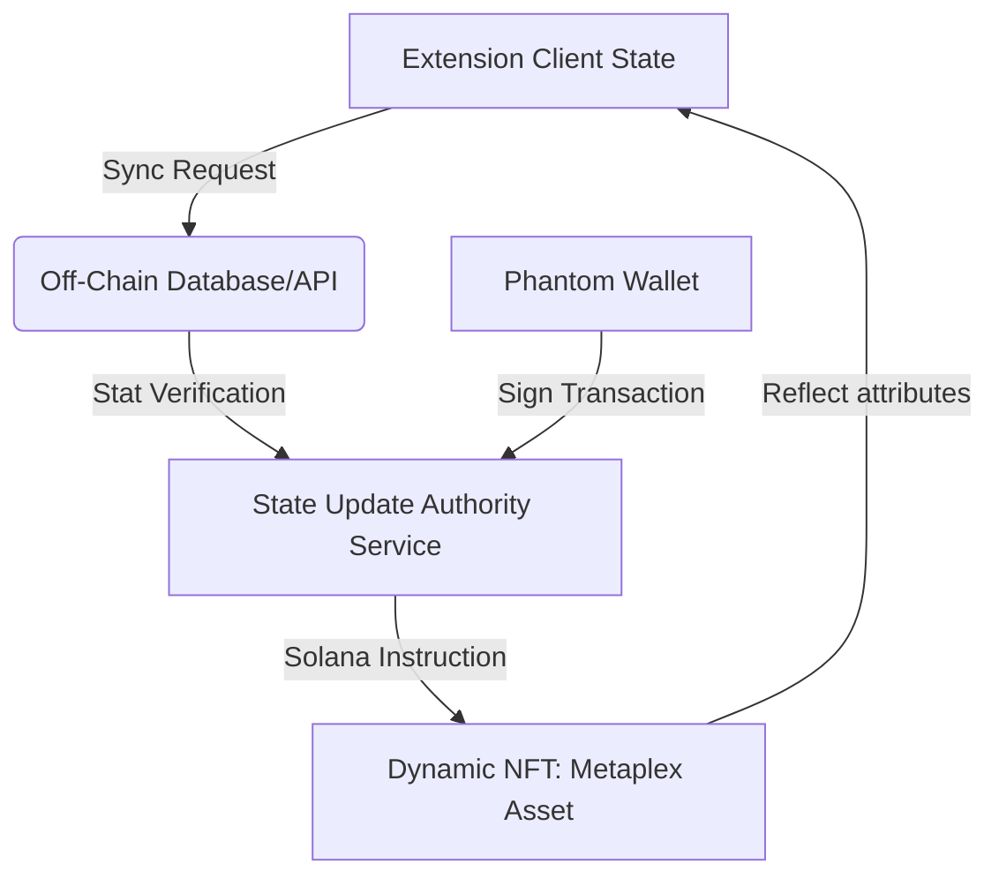

# Progress & Master Development Roadmap: CyberPet MMORPG

This document tracks the current features of the CyberPet Companion extension and outlines the roadmap for scaling it into a Solana-powered Dynamic NFT RPG.

---

## 🛠 Phase 1: Core Extension MVP (Completed)
- **SVG Companion System**: Native, zero-asset rendering of `Sol-Cat`, `Astro-Dog`, and `Cyber-Bunny` with fluid states (idle, walk, eat, sleep, happy).
- **Page Overlay Injection**: Draggable widget loaded inside a Shadow DOM, preventing host stylesheet pollution.
- **Micro-Interactions**: Feed, pet, follow toggling, and contextual bubble speech containing funny developer/crypto punchlines.
- **Vitals Loop**: Passive hunger, energy, and happiness decay managed via background service worker.
- **Glassmorphic Management Stable**: Extension popup with vital meters, stable switcher, and Solana Wallet mock connection.
- **Dynamic NFT Schema Exporter**: Real-time generation of Metaplex-compliant JSON metadata representation representing pet stats.

---

## 🗺 Phase 2: RPG Mechanics & Economy (Planned)

### 1. Leveling & Stages
- **Detailed Stages**: Baby (Lv 1-4) ➔ Teen (Lv 5-9) ➔ Adult (Lv 10+).
- **RPG Stats Allocation**: Every level-up grants stat points to allocate to **Strength** (battle power), **Agility** (reduces travel times), and **Intelligence** (reduces cooldowns, boosts minigame rewards).

### 2. Game Credits & Economy Loop
- **Credits ($PETCOIN)**: In-game off-chain currency earned via daily quests, productive time tracking (e.g., active coding time), and idle exploration.
- **Money Sinks (Currency sinks)**:
  - **Consumables Store**: Purchase premium foods (giving permanent minor buffs), styling elements, or toys.
  - **Stable Upgrades**: Expansion slots to host more than 3 pets.
  - **Adventure Energy Reagents**: Consumables to instantly restore energy for minigames.

### 3. Database Sync & Auth (Completed)
- **Supabase Integration**: Securely connection URL and public Anon Key to local storage, replacing manual simulated server mocks.
- **Bi-directional Sync**: Implemented auto-saving of local pet progress up to live PostgreSQL database rows, and restoration of existing online progress when signing into a new device.
- **Service Worker Background Sync**: Added background sync capability within the game alarm loop to update remote databases even when the dashboard popup is closed.

### 4. Secure Server-Authoritative Loop (Completed)
- **Database Functions (RPCs)**: Secure shop purchases, item usage, stat point allocations, and pomodoro timer rewards validation inside PostgreSQL definer functions.
- **Client Adaptation**: Convert client methods to dispatch database calls to validation functions, guaranteeing fairness.
- **Bug Fix (Focus Completion)**: Fixed a race condition where completing focus sessions triggered infinite repeating popup alerts due to re-entrant calls before local storage fully updated.
- **RPG Mechanics Blueprint**: Authored [mechanic.md](file:///e:/2025code/2026/livepet/mechanic.md) specifying progression curves, vitals decay rates, and attribute behaviors.

---

## 🧬 Phase 3: Breeding & Stable Management (Planned)

### 1. Breeding Engine
- **Breeding Cost**: A burn mechanism involving `$PETCOIN` + Solana native tokens to prevent infinite inflation.
- **Genetic Mixing**:
  - Two parent NFTs of any level (min Lv 10) can breed to produce an **Egg**.
  - Offspring inherits mixed SVGs (e.g., Cat with Space Helmet, Cyber-bunny with Purple glow) using dynamic SVG component rendering.
  - Generative DNA stored in the NFT attributes.

### 2. Advanced Stable Management
- **Browsing Dashboard**: Fullscreen web page (stable.cyberpet.io) that opens from the extension, allowing users to view their active lineup in a 3D or high-definition grid view.
- **Staking**: Send inactive pets on "Adventures" or "Solana Validator Staking Expeditions" to passive-yield game items.

---

## ⛓ Phase 4: Blockchain Sync & Dynamic NFTs (Planned)

- **Hybrid State Architecture**:
  - **Off-Chain (Fast/Free)**: Hunger, energy, and temporary items. Saved instantly in extension state + database to keep gameplay lightweight and lag-free.
  - **On-Chain (Secure/Decentralized)**: Levels, XP milestone, Breed Count, and Genetic DNA. Synced periodically (or on-demand when leveling up) via Solana transactions to update Metaplex Core/Bubblegum compressed NFTs.
- **Metaplex Dynamic Assets**: Utilizing modern Solana Dynamic NFTs where state changes update the URI JSON directly from a certified validator API.

---

## 🌐 Phase 5: Multiplayer & Co-Op Screen Aspects (Planned)

- **Peer-to-Peer Visuals**: If two users are on the same website, their companions can render on each other's screen using lightweight WebSockets (e.g. `socket.io` or Solana-backed state lobbies).
- **Co-op Battles**: Fight virtual boss monsters spawned on websites (like a "StackOverflow Bug Monster") to earn rare gear.
- **Marketplace Grid**: Direct peer-to-peer breeding requests or buying/selling pets on a Solana DEX.
