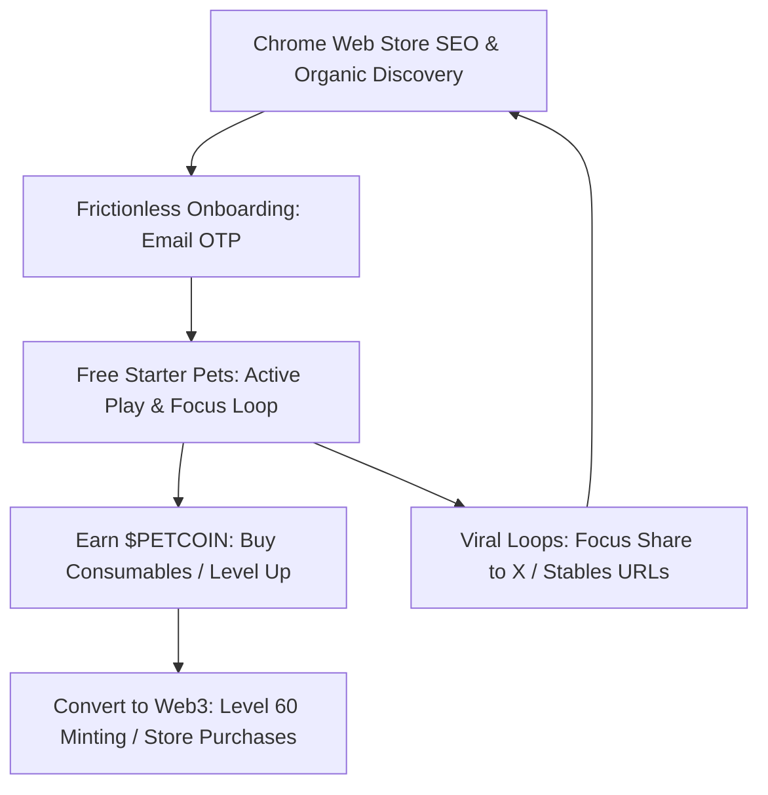

# DeskPet Strategy and Architecture: Launch, Tokenomics, and Security

DeskPet is a Web3-enabled Chrome Extension (Manifest V3) desktop pet RPG. It bridges real-world productivity (Pomodoro/focus sessions) with Web3 gaming (Solana Devnet NFTs, dual-token yield loops, breeding, multiplayer lobbies, and RPG gear progression). This document outlines the current project status and provides a strategic roadmap for user acquisition, tokenomics, monetization, and backend security.

---

## 🛠️ 1. Current Development Status Update

The core features of the DeskPet companion RPG are successfully implemented across the Extension, Express Server, and Supabase database. The implementation status of the critical modules is detailed below:

| Module | Features Implemented | Technical Mechanics | Status |
| :--- | :--- | :--- | :--- |
| **1. Dynamic Onboarding** | Generates 3 random Level 1 starter pets. | Randomizes species (`sol-cat`, `astro-dog`, `cyber-bunny`), names, and starter skins. SVGs render correctly. | **100% Complete** |
| **2. Cyber Store** | Mystery Pet Eggs (500 $DESK) and Treasury Level 60 Pets (5,000 $DESK). | Solves RPC indexing delays using a 2-minute grace-period. Evicted pets (sold/transferred) are locked instead of deleted. | **100% Complete** |
| **3. Level 60 Restriction** | Restricts standard starter pet minting. | Disables the "Mint NFT" button until the pet reaches max level (60), creating an endgame progression goal. | **100% Complete** |
| **4. On-Chain Sync Loop** | Auto-fetches and syncs NFTs in active wallets. | Scans both local extension wallets and Privy MPC wallets. Locks pets when corresponding NFTs are transferred away. | **100% Complete** |
| **5. Generative Rarity** | Egg purchases roll random rarities & aesthetics. | Rolls: Common (60%), Rare (25%), Epic (12%), Legendary (3%). Skins map to tiers (e.g., Neon Rainbow for Legendary). | **100% Complete** |
| **6. Gameplay Multipliers** | Rarity boosts to yield, focus payouts, and XP. | Common (1.0x), Rare (1.25x), Epic (1.5x), Legendary/Treasury (2.0x) multipliers scale active interactions and Focus gains. | **100% Complete** |
| **7. Breeding Engine** | Crosses genetic HSL DNA of two parent pets. | Executed on the Express server; requires two Level 60 parents, 100k $PETCOIN, and 5k $DESK. | **100% Complete** |
| **8. Multiplayer & PvP** | WebSockets-based social lobby and card combat. | Shared workspace viewing, automated combat simulations, and WoW-style random gear drops (5 rarity tiers). | **100% Complete** |

### 🔍 Identified Gaps to Address Before Public Release

1. **Client-Side Rarity Rolls:** The Mystery Egg rarity rolling is currently executed inside the client's `background.js`. Since client-side JavaScript is modifiable, malicious users could alter the rolling function or intercept messages to force-roll Legendary pets.
2. **Server Deployment:** The Express server, which hosts multiplayer WebSockets, gear generation, PvP calculations, and breeding logic, is running on `localhost:3001` and needs cloud deployment (e.g., Render, Railway, AWS).
3. **Key Exposure Risk:** Critical API secrets and the Solana distributor keypair are referenced or loaded locally. They must be moved to secure environment variables or a key vault.
4. **RPC Server Limits:** Devnet RPC nodes rate-limit standard connections. A dedicated RPC wrapper or premium RPC endpoint (such as Helius or QuickNode) is required for public mainnet deployment.

---

## 📈 2. User Acquisition & Publication Strategy

Building an excellent game is only half the battle. To acquire **100k+ active users**, DeskPet must combine low-friction Web2.5 onboarding with viral sharing loops and Chrome Web Store search optimization.



### A. The Chrome Web Store Funnel

* **Title & Keywords:** Optimize the extension store title: `DeskPet RPG: Focus Timer & Virtual Web3 Companion`. Target keywords like `Pomodoro Timer`, `Focus Tracker`, `Tamagotchi`, `Idle Game`, and `Solana RPG`.
* **Visual Wow Factor:** Use high-contrast, neon-cyberpunk screenshots of the dashboard. Create a 30-second promo video showing the pet walking on webpages, active focus timers, and Level 60 evolution glows.
* **Lightweight Install:** Ensure the extension remains under 5MB. Embed only core SVGs and stream large assets/textures dynamically from a CDN if needed.

### B. Frictionless Onboarding (The Web2.5 Hook)

Traditional Web3 onboarding (setting up a wallet, writing down seed phrases, buying SOL for gas) loses over 90% of potential players. DeskPet implements a **delayed conversion** model:

1. **Zero-Wallet Sign-Up:** Users install the extension and log in using email OTP via Privy.
2. **Silent Provisioning:** An embedded Solana wallet is automatically generated for them in the background (no seed phrases shown to the user initially).
3. **Immediate Free Gameplay:** The user receives 3 random starter pets and starts playing. They can earn `$PETCOIN` and level up their pets without executing any blockchain transactions.
4. **Delayed Web3 Interaction:** The user only signs transactions when they choose to purchase premium Store eggs (500 `$DESK`) or mint their Level 60 pet onto the blockchain. By this time, they are already invested in their pet's progression.

### C. Viral Growth Loops

To grow organically, we must encourage users to share their progress:

* **"Focus-to-Earn" Share Cards:** After completing a 25-minute focus session, show a beautiful share overlay. E.g., *"My Legendary Crypto Thumper just helped me focus for 25 minutes and earned 150 $PETCOIN! 🐰🔋"* with a 1-click button to share on X (Twitter).
* **Shared Virtual Workspace:** Since WebSockets are implemented, allow users to create "Co-Working Rooms." Teammates' pets appear on each other's browser windows, making productivity social.
* **Public Stable Pages:** Every user has a unique public URL (e.g., `deskpet.gg/stable/username`) hosted on the web dashboard showcasing their active pets, rarities, gear, and levels.
* **Referral Multiplier Boosts:** Introduce a referral system where inviting a friend grants both players a temporary +5% XP/yield multiplier.

---

## 🪙 3. Dual-Token Economics Deep Thinking ($PETCOIN & $DESK)

DeskPet's economy relies on two currencies: **$PETCOIN** (an off-chain soft progression currency) and **$DESK** (an on-chain hard utility/governance token on Solana).

```
                      ┌─────────────────────────────────┐
                      │    ON-CHAIN (Solana Mainnet)    │
                      │                                 │
                      │          $DESK Token            │
                      └────────────────┬────────────────┘
                                       │
                        Purchases Eggs │ Breeding Fee
                        & Treasury Pets│ (5,000 $DESK)
                                       ▼
                      ┌─────────────────────────────────┐
                      │           Pet NFTs              │
                      └────────────────┬────────────────┘
                                       │
                      Expeditions &    │ Rarity Multipliers
                      Active Staking   │ Boost Yields
                                       ▼
                      ┌─────────────────────────────────┐
                      │    OFF-CHAIN (Progression)      │
                      │                                 │
                      │         $PETCOIN Token          │
                      └────────────────┬────────────────┘
                                       │
                        Buys Consumables│ Stat Resets /
                        (Treats, Toys) │ Evolution Taxes
                                       ▼
                      ┌─────────────────────────────────┐
                      │          Pet Progression        │
                      └─────────────────────────────────┘
```

### A. $PETCOIN: Off-Chain Soft Currency

* **Purpose:** Drives daily gameplay loops, progress, and vital restoration. Since it is off-chain, players make hundreds of micro-transactions (petting, feeding, playing) without paying Solana gas fees.
* **Sources (Earning):**
  * **Passive Yield:** Accumulated based on pet level and intelligence.
  * **Focus Rewards:** Earned by running productivity sessions.
  * **Expeditions:** Sending inactive pets on 2h, 4h, or 8h digital staking journeys.
* **Sinks (Burning):**
  * **Consumables Shop:** Food (Treats), playthings (Toys), and batteries (Energy) are required to prevent vitals from decaying to zero. If vitals are at 0, passive yield decreases or XP gain freezes.
  - **Evolution & Level Milestones:** Leveling up at major intervals (e.g., Lv 20, Lv 40) requires burning large amounts of `$PETCOIN`.
  - **Attribute Respecs:** Fee to reset strength, agility, or intelligence points.
  - **Breeding Cost:** Breeding requires a high base fee of 100,000 `$PETCOIN` (alongside `$DESK`).
* **Inflation Management:**
  - **Daily Focus Earnings Cap:** Limit focus earnings to a maximum of 3 hours per day. This prevents botting scripts from running focus timers continuously.
  - **Aggressive Decay:** Vitals decay quickly. If a player goes inactive for days, their pets fall asleep or starve, pausing all token yield accumulation.

### B. $DESK: On-Chain Hard Token

* **Purpose:** Operates as the premium asset, governance voice, and value-capture mechanism on Solana.
* **Suggested Token Distribution (100,000,000 Total Supply):**
  * **40% - Ecosystem & Staking Rewards:** Managed by the distributor server to reward long-term staking expeditions and seasonal leaderboard placements.
  * **25% - Liquidity Pool:** Seeded on Solana DEXs (Raydium/Orca) with locked LP tokens.
  * **15% - Development & Operations:** Dedicated to server hosting, marketing campaigns, and RPC node infrastructure.
  * **12% - Team & Advisors:** Subject to a 6-month cliff and a linear 24-month monthly vesting schedule.
  * **8% - Community Airdrops & Referrals:** Rewarding early beta-testers.
* **Sinks (Buying Pressure):**
  * **Egg Minting (500 $DESK):** Minting a new random Level 1 pet egg.
  * **Treasury Pet Purchase (5,000 $DESK):** Buying limited max-level pets (collection capped at 3,333).
  * **NFT Minting Fee:** Converting a Level 60 off-chain pet into an on-chain NFT requires a gas and protocol fee in `$DESK`.
  * **Breeding Tax (5,000 $DESK per breed):** Acts as a deflationary token burn to control pet supply inflation.
  * **Marketplace Platform Fees:** A 2.5% fee on all peer-to-peer trades of pet NFTs and RPG gear, collected in `$DESK` and burned.

---

## 💎 4. Gamified Monetization Models

Sustainable web3 gaming requires monetization models that go beyond selling speculative tokens:

1. **Direct NFT & Egg Sales:** Recurring revenue from players purchasing Mystery Eggs and cosmetic vanity items.
2. **RPG Gear Gacha & Re-rolling:** Players earn weapons, headwear, armor, and AI chips through PvP and expeditions. They can spend a mix of `$PETCOIN` and `$DESK` to upgrade gear stats or re-roll sub-stats (e.g., turning a Strength boost into an Agility boost).
3. **The Focus Pass (Battle Pass):** A monthly subscription priced at $10 (payable in `$DESK` or credit card). Grants players:
   - Double XP on focus sessions.
   - Exclusive neon cosmetics and dashboard backgrounds.
   - Special seasonal expeditions with high-tier gear drop rates.
4. **Sponsored Focus Campaigns:** Businesses can pay to sponsor the desktop companion interface. For example, during a 45-minute focus session sponsored by a major productivity brand:
   - The user's pet wears branded gear.
   - Completing the session rewards the player with a branded consumable or cosmetic.
   - The developer charges a fee to the sponsor, creating non-web3 revenue to support buyback-and-burn operations for the token.
5. **Secondary Market Royalties:** Enforcing a 5% creator royalty on all secondary NFT sales. Since pets accumulate levels, stats, and gear, highly optimized pets will hold significant market value.

---

## 🔒 5. Game Backend & Web3 Security Framework

Transitioning from a development environment to a public launch exposes the game to exploits, reverse engineering, and sybil botting. The following security frameworks must be implemented before deploying the game to Solana Mainnet:

### A. Rarity Roll Migration (High Priority)

> [!CAUTION]
> **Current Vulnerability:** Rarity rolling is performed client-side in the extension's background script. Users can manipulate local states to guarantee legendary rolls.

* **Target Security Architecture:**
  1. The client initiates a purchase by calling `/api/store/buy-egg` on the backend server.
  2. The server generates a unique transaction challenge and returns it to the client.
  3. The client signs and broadcasts the transfer of `$DESK` tokens to the treasury.
  4. The server listens for transaction confirmation on the Solana blockchain.
  5. Once confirmed, the **backend server** rolls the rarity cryptographically using secure seed random generators, mints the NFT using the distributor key, and updates the pet details in Supabase.
  6. The client receives the confirmed, immutable pet metadata.

### B. Securing the Distributor Keypair

> [!WARNING]
> The current system loads `distributor-keypair.json` directly from the server project directory. If the codebase is compromised, the private key is exposed.

* **Production Guidelines:**
  * **Environment Secrets:** Store keypair secrets exclusively in encrypted environment variables (`DISTRIBUTOR_KEYPAIR`) on server hosting platforms. Never commit key files to repository histories.
  * **Treasury Isolation:** The distributor wallet should only hold small amounts of SOL for minting fees and no significant capital. The primary `$DESK` pool must be stored in a secure Multi-Signature wallet (e.g., Squads) requiring signatures from multiple developers/operations keys.

### C. Supabase Row Level Security (RLS) & RPC Hardening

Direct database writes from the extension client must be restricted to prevent players from manual level editing:

* **RLS Policies:**
  * Configure RLS so that users can only `SELECT` records matching their own authenticated `user_id`.
  * Restrict `UPDATE` and `INSERT` permissions on the `pet_state` table.
* **Server-Authorized Upgrades:**
  * All gameplay progress modifications (e.g., leveling up, allocating stat points, completing expeditions) must be calculated and validated by the backend server. The extension sends requests with Privy JWT auth tokens; the server validates the math (e.g., *Is the accrued XP actually sufficient for level 12?*) and updates the database.

### D. Anti-Cheat & Focus Timer Verification

To prevent players from writing scripts that simulate focus sessions for infinite `$PETCOIN`:

* **Active Heartbeat Checks:** The extension must send periodic encrypted heartbeats to the server during focus sessions. The heartbeat payload should include telemetry data (e.g., active window focus state, mouse movements, cursor positions) to verify human presence.
* **Server-Side Session Logging:** The server logs the exact epoch timestamp when a focus session starts. If a client sends a `focus_complete` message, the server verifies that the elapsed real time matches the claimed focus duration before rewarding the user.
* **Hourly and Daily Caps:** Enforce strict caps on maximum focus rewards per 24 hours.

### E. Solana Transaction Verification (Replay Attack Prevention)

Prevent malicious users from submitting duplicate or invalid transaction hashes to claim multiple store purchases:

* **Purchase Challenge Verification:** Maintain a `processed_transactions` table in Supabase. When a transaction hash is submitted:
  1. The server checks if the hash already exists in the table. If it does, reject the request.
  2. The server queries the Solana RPC node (`getTransaction`) to verify:
     - The transaction status is successful.
     - The token transfer recipient is the designated Treasury ATA.
     - The transfer token is `$DESK` and the amount is correct.
     - The sender wallet matches the authenticated user's wallet.
     - The block time is within the last 5 minutes.
  3. If all checks pass, write the hash to `processed_transactions` and grant the purchase items.
