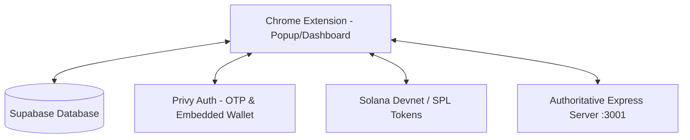

# DeskPet System Memory & Context Loader
*Last Updated: 2026-05-30*

This file captures the full system design, current integration state, and operational details of the **DeskPet** Chrome Extension RPG to enable immediate context recovery in new workspace sessions.

---

## 🛠️ 1. Project Overview & Architecture
DeskPet is a Web3-enabled Chrome Extension (Manifest V3) desktop pet RPG with double-token dynamics, on-chain minting on Solana Devnet, and Privy auth syncing to Supabase.

---

## 📂 2. Key Files & Responsibilities
- **[manifest.json](file:///e:/2026/code/deskpet/manifest.json)**: Extension manifest (V3) specifying permissions, service workers, and active tab overrides.
- **[background.js](file:///e:/2026/code/deskpet/background.js)**: Authoritative service worker containing pet vital decay loops, local hot-wallet transaction routines, SOL/$DESK pre-flight balance checks, and stores purchase backend endpoints.
- **[dashboard.html](file:///e:/2026/code/deskpet/dashboard.html)** & **[dashboard.js](file:///e:/2026/code/deskpet/dashboard.js)**: Main configuration page containing the Pet Stables list, the **🏪 Store**, dynamic onboarding status, dual-wallet NFT sync logic, and interactive mechanics.
- **[config.js](file:///e:/2026/code/deskpet/config.js)**: Holds contract, token, and API endpoint constants.
- **[supabase.js](file:///e:/2026/code/deskpet/supabase.js)**: Database client wrapper and sync handlers for state persistence.
- **[privy-auth.html](file:///e:/2026/code/deskpet/privy-auth.html)** & **[privy-auth.js](file:///e:/2026/code/deskpet/privy-auth.js)**: Handle authentication and auto-provisioning of Solana embedded wallets.

---

## ⛓️ 3. Web3 & Token Configurations (Solana Devnet)
- **$DESK SPL Token Mint**: `AtdpNbFfYWqaE4bVrwh7mP3jE7K2NSJCiCodvbxGXJt2`
- **Distributor/Treasury Authority**: Loaded from `distributor-keypair.json`
- **Signing Paradigm**:
  - **Local Extension Wallet** (`solanaWalletPubkey` in local storage) acts as the transaction signer for on-chain store purchases and mints due to Manifest V3 iframe CSP restrictions on Privy.
  - **Privy Wallet**: Scanned alongside the local wallet during on-chain synchronization to allow importing/protecting pets stored in the secure Privy MPC wallet.

---

## 📊 4. Core Features & Mechanical States
1. **Dynamic Starter Onboarding**: New users receive exactly 3 randomized common pets (`sol-cat`, `astro-dog`, or `cyber-bunny`) at Level 1, styled with randomized skins.
2. **Mystery Pet Eggs & Treasury Pets**:
   - **Egg**: 500 `$DESK` (Spawns a Level 1 common pet).
   - **Treasury Pet**: 5,000 `$DESK` (Fully leveled Level 60 pet, pre-allocated 295 attribute points, rare matrix/rainbow skin. Collection capped at 3,333).
3. **Grace-Period Protection & Locking**:
   - Solana Devnet's JSON-RPC indexing lag is mitigated by a **2-minute grace period** (`120,000ms`) since `obtainedAt`.
   - Pets whose NFTs are no longer owned are **Locked (`STATUS: LOCKED 🔒`)** instead of immediately deleted, retaining all accrued level, XP, and stat allocations.
4. **Manual Stable Release**: Users can permanently release unwanted inactive pets using the `❌` button in the stables list.
5. **Generative Rarity & Multipliers (Option A)**:
   - Mystery Eggs roll random rarities: Common (60%), Rare (25%), Epic (12%), Legendary (3%).
   - Skin aesthetics match the rolled rarity tier (Legendary gets Neon Rainbow, Epic gets Matrix/Purple, etc.).
   - Gameplay yields scale by the active companion's rarity multiplier: Common (1.0x), Rare (1.25x), Epic (1.5x), Legendary/Treasury (2.0x).
   - Rarity multipliers scale all passive token yields, active XP gains (petting, feeding, items), and Focus timer payout rewards (both periodic and manual).
6. **Species Resolution for SVG Rendering**: Pets are generated with unique IDs (e.g. `sol-cat-xyz`). The SVG renderer resolves the pet's species (e.g., checking the `species` field or ID prefix) to map it to the correct static asset definitions (`sol-cat`, `astro-dog`, `cyber-bunny`) inside `PET_ASSETS`.
7. **Stable Standings Scroll Containment**: Enables vertical scrolling (`overflow-y: auto`) on `#stable-metrics-view` to prevent overflowing and layout overlapping when stable count exceeds 3 pets.
8. **Resilient Offline Auth Sync**: Supabase session sync in background worker is wrapped in a try-catch to allow local signin & play even if Supabase sync encounters domain-specific blocks or rate limits.
9. **Solana RPC Debounce**: On-chain sync features a 15-second debounce check to prevent HTTP 429 rate limit issues on the RPC network.
10. **CSP Inline Event Compliance**: Inline event handler attributes are replaced by CSS pseudo-classes (`.release-pet-btn:hover`) to satisfy Manifest V3 CSP constraints.

---

## 💻 5. Running & Developing
- **Game Server / Distributor API**: Starts via `npm start` (runs on port `3001`).
- **Airdrops & Funding**: Use **🪂 Airdrop User SOL** (Devnet SOL) and **🪂 Airdrop User $DESK** (Mints 10,000 `$DESK` from the distributor) directly in the UI dashboard to fund the active wallet.

---

## 💎 6. Onboarding & Economy Balance (Development Version)
The following mechanisms are active in the local development version:
1. **Wallet-Free Passive Yield**:
   - Free users can play the game and accumulate off-chain `$PETCOIN` yield without a connected wallet.
   - **Stables Multi-Pet Yield Scaling**: Inactive pets in stables contribute +25% of their yield rate to the active companion's base yield.
   - **Active Bonding Boost**: Actions (`feed`, `pet`, `useItem`) grant a 1.5x yield multiplier for 15 minutes.
2. **Staking Expeditions & Entrant Fees**:
   - Users pay `$PETCOIN` entrant fees to start staking expeditions. Fees are configurable via the admin panel.
   - **Obstacle & Success Rate**: Strength-based checks determine success. Failed expeditions still reward partial experience (failed effort XP).
3. **Staking Rewards & Safeguards**:
   - Premium (minted) pets earn real `$DESK` rewards on completed expeditions.
   - **Daily Wallet Cap**: 150 `$DESK` maximum per wallet per day to prevent automated farming.
   - **Dynamic Halving**: Staking rewards automatically scale down (to 75% or 50%) based on distributor wallet reserves.
   - **Recycling Sink**: 70% of all breeding/minting `$DESK` transaction fees are recycled back into the distributor staking rewards pool, and 30% are burned on-chain.
4. **High-Stakes Breeding**:
   - Breeding two premium (minted) pets triggers a 50/50 RNG burn of either Parent A or Parent B, removing it from the stable. The Newborn screen explicitly notifies the user which parent was burned.
5. **Local-Only Admin Panel**:
   - The config dashboard (`admin.html`) is guarded locally, allowing updates to staking entrant fees and prices only from `localhost`/`127.0.0.1`.
6. **RPG Gear**:
   - References to "WoW" or "World of Warcraft" are fully scrubbed, standardizing on generic "RPG Gear".

